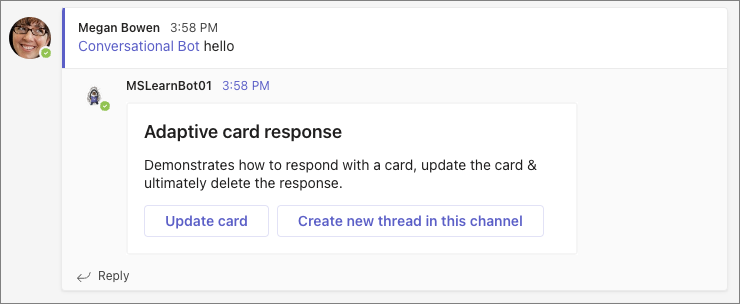
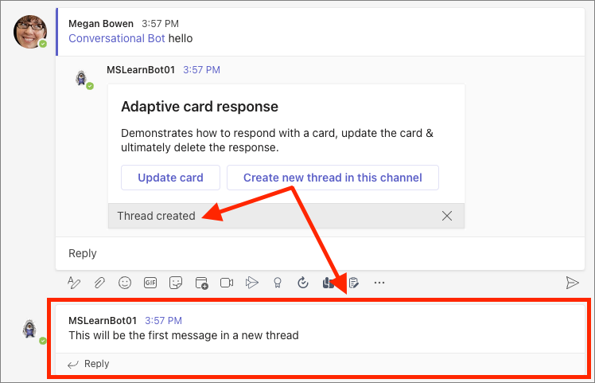

# Exercise 3: Sending proactive messages from bots

In this exercise, you’ll update the existing Teams app to send a proactive message from your bot.

> [!IMPORTANT]
> This exercise assumes you have created the Microsoft Teams app project with the Yeoman generator

## Start a proactive message from the bot

Locate and open the card in the file **./src/server/conversationalBot/cards/responseCard.json**.

Locate the section at the end of the card for the `ActionSet`. Add the following action to the existing `actions` array:

```json
{
  "type":"Action.Execute",
  "title":"Create new thread in this channel",
  "verb":"newconversation"
}
```

The card should now look like the following:

```json
{
  "$schema": "http://adaptivecards.io/schemas/adaptive-card.json",
  "type": "AdaptiveCard",
  "version": "1.4",
  "body": [
    {
      "type": "Container",
      "items": [
        {
          "type": "TextBlock",
          "text": "Adaptive card response",
          "weight": "bolder",
          "size": "large"
        }
      ]
    },
    {
      "type": "Container",
      "items": [
        {
          "type": "TextBlock",
          "text": "${message}",
          "wrap": true
        }
      ]
    },
    {
      "type": "ActionSet",
      "actions": [
        {
          "type": "Action.Execute",
          "title": "Update card",
          "verb": "update",
          "data": {
            "count": "${count}"
          }
        },
        {
          "type": "Action.Execute",
          "title": "Create new thread in this channel",
          "verb": "newconversation"
        },
        {
          "type": "Action.Execute",
          "title": "Delete card",
          "verb": "delete",
          "$when": "${showDelete}"
        }
      ]
    }
  ]
}
```

Locate and open the bot in the file **./src/server/conversationalBot/ConversationalBot.ts**.

Add the following objects to the existing `import {...} from "botbuilder";` statement you'll need:

```typescript
import {
  MessageFactory,
  Activity,
  BotFrameworkAdapter,
  teamsGetChannelId,
  ConversationParameters,
  // existing imports omitted for clarity
} from "botbuilder";
```

Next, add another `case` statement to the `switch (verb)` statement in the `onAdaptiveCardInvoke()` handler to detect this new action:

```typescript
case "newconversation":
{
  const message = MessageFactory.text("This will be the first message in a new thread");
  await this.teamsCreateConversation(context, message);
  return Promise.resolve({
    statusCode: 200,
    type: "application/vnd.microsoft.activity.message",
    value: "Thread created"
  });
}
```

The last step is to add the `teamsCreateConversation()` method that will create the new conversation. Add the following method to the `ConversationalBot` class:

```typescript
private async teamsCreateConversation(context: TurnContext, message: Partial<Activity>): Promise<void> {
  // get a reference to the bot adapter and create a connection to the Teams API
  const adapter = <BotFrameworkAdapter>context.adapter;
  const connectorClient = adapter.createConnectorClient(context.activity.serviceUrl);

  // set current teams channel in new conversation parameters
  const teamsChannelId = teamsGetChannelId(context.activity);
  const conversationParameters: ConversationParameters = {
    isGroup: true,
    channelData: {
      channel: {
        id: teamsChannelId
      }
    },
    activity: message as Activity,
    bot: context.activity.recipient
  };

  // create conversation and send message
  await connectorClient.conversations.createConversation(conversationParameters);
}
```

### Test the bot sending new messages

From the command line, navigate to the root folder for the project and execute the following command:

```console
gulp ngrok-serve --debug
```

> [!IMPORTANT]
> Recall from a previous exercise, Ngrok will create a new subdomain. You need to update your bot registration's **Messaging endpoint** in the Azure portal (*shown in a previous exercise*) with this new domain before testing it.

In the Microsoft Teams client, go to the channel you installed the bot in the previous section. From the **Conversations** tab, @mention the bot with a random string to trigger the `else` condition.

The bot will reply to the message with the updated card that contains two buttons:



Select the second button, **Create new thread in this channel**. Within a few seconds, you should see a new conversation appear in the channel:



## Summary

In this exercise, you’ll modify the existing Microsoft Teams app update the bot to send a proactive message from your bot.
